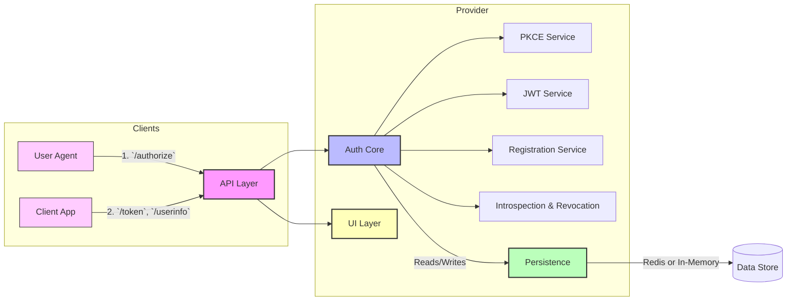
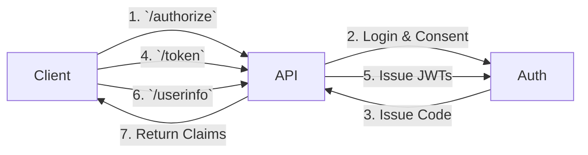

# Flask OIDC Provider

**A robust, standards-compliant OpenID Connect (OIDC) Provider built with Flask.**

---

## 🚀 Overview

This repository implements a full-featured OIDC Provider using Flask, supporting the Authorization Code Flow with PKCE, dynamic client registration, token lifecycle management, and extensible storage backends (in-memory or Redis). It follows the [OIDC Core 1.0](https://openid.net/specs/openid-connect-core-1_0.html) specification, ensuring interoperability with any OIDC-compatible client.

**Key Capabilities:**

* 🔑 **PKCE Authorization Code Flow**
* 🔄 **Access & Refresh Token Management** (rotation, revocation, introspection)
* 📑 **Dynamic Client Registration**
* 🗝️ **RS256-signed JWTs** with JWKS endpoint
* 🧰 **Extensible Storage** (In-Memory / Redis)
* 🎨 **Customizable UI Templates** for login & consent
* 🛠️ **Docker & Gunicorn** ready
* 🧪 **Comprehensive Pytest Suite**

---

## 📁 Repository Structure

```text
flask-oidc-provider/
├── app.py                    # Flask app initialization & route registration
├── config.py                 # Configuration loader (env, defaults)
├── models.py                 # ORM-like models for Client, Code, Token
├── auth/
│   ├── pkce.py               # PKCE verifier & challenge utilities
│   ├── token.py              # JWT creation, validation, introspection
│   └── registration.py       # Dynamic client registration logic
├── store/
│   ├── memory.py             # In-memory data store implementation
│   └── redis_store.py        # Redis-backed store implementation
├── templates/
│   ├── login.html            # User login page
│   └── consent.html          # User consent page
├── static/                   # CSS/JS assets
├── keys/
│   ├── private.pem           # RSA private key
│   └── public.pem            # RSA public key
├── jwks.json                 # JSON Web Key Set (auto-generated)
├── requirements.txt          # Python dependencies
├── Dockerfile                # Container image
├── docker-compose.yml        # Service orchestration (app + Redis)
├── .env.example              # Sample environment variables
├── tests/                    # Unit & integration tests
│   ├── test_flow.py
│   └── test_endpoints.py
├── .github/
│   └── workflows/ci.yml      # GitHub Actions for linting & tests
├── CONTRIBUTING.md
├── CODE_OF_CONDUCT.md
└── README.md                 # This documentation
```

---

## 🏗️ Modular Architecture

High-level component diagram illustrating core modules and their interactions:



---

## 🔄 Sequence Diagram



Steps:

1. Client calls `/authorize` → API handles login & consent.
2. Auth issues code → API returns to client.
3. Client calls `/token` → API issues JWTs.
4. Client calls `/userinfo` → API returns user claims.

---

## 🔧 Installation & Setup

### Prerequisites

* **Python 3.9+**
* **Redis** (optional, for production)
* **Docker & Docker Compose** (for containerized setup)

### Clone & Virtual Environment

```bash
$ git clone https://github.com/your-org/flask-oidc-provider.git
$ cd flask-oidc-provider
$ python3 -m venv .venv
$ source .venv/bin/activate
$ pip install --upgrade pip
$ pip install -r requirements.txt
```

### Environment Variables

Copy `.env.example` to `.env` and configure:

```ini
FLASK_ENV=development
SECRET_KEY=CHANGE_ME
ISSUER_URL=http://localhost:5000
PRIVATE_KEY_PATH=keys/private.pem
PUBLIC_KEY_PATH=keys/public.pem
TOKEN_EXPIRES_IN=3600
REFRESH_TOKEN_EXPIRES_IN=86400
REDIS_URL=redis://localhost:6379/0   # only if using Redis
```

### Generating RSA Keys & JWKS

```bash
$ openssl genrsa -out keys/private.pem 2048
$ openssl rsa -in keys/private.pem -pubout -out keys/public.pem
$ python app.py --generate-jwks   # writes jwks.json
```

---

## ▶️ Running Locally

**Without Redis (Memory Store):**

```bash
$ flask run --host=0.0.0.0 --port=5000
```

**With Docker Compose (Redis + App):**

```bash
docker-compose up --build
```

Open [http://localhost:5000/.well-known/openid-configuration](http://localhost:5000/.well-known/openid-configuration) to verify discovery.

---

## 📖 API Reference

> All endpoints expect `Content-Type: application/json` unless noted.

| Method | Path                                | Description                                                           | Auth                                        |
| ------ | ----------------------------------- | --------------------------------------------------------------------- | ------------------------------------------- |
| POST   | `/register`                         | Dynamic client registration                                           | n/a                                         |
| GET    | `/.well-known/openid-configuration` | OIDC discovery metadata                                               | n/a                                         |
| GET    | `/jwks`                             | JSON Web Key Set                                                      | n/a                                         |
| GET    | `/authorize`                        | Initiate login & consent (query params)                               | n/a                                         |
| POST   | `/authorize`                        | Submit credentials (form-data: `username`, `password`), then redirect | n/a                                         |
| POST   | `/consent`                          | Submit consent (form-data: `client_id`, `scopes`)                     | Session cookie                              |
| POST   | `/token`                            | Exchange code for tokens (x-www-form-urlencoded). See example below.  | Basic/Auth or client\_id+secret within body |
| POST   | `/revoke`                           | Revoke access/refresh tokens                                          | Basic/Auth or body                          |
| POST   | `/introspect`                       | Introspect token validity                                             | Basic/Auth                                  |
| GET    | `/userinfo`                         | Retrieve user claims from access token                                | Bearer Token                                |

---

## 🛠️ Sample Requests

### 1) Register Client

```bash
curl -X POST http://localhost:5000/register \
  -H 'Content-Type: application/json' \
  -d '{
    "client_name": "spa-app",
    "redirect_uris": ["http://localhost:3000/callback"],
    "grant_types": ["authorization_code"],
    "response_types": ["code"],
    "scope": "openid profile email"
}'
```

**Response (201):**

```json
{
  "client_id": "abc123",
  "client_secret": "shh-its-a-secret",
  "redirect_uris": ["http://localhost:3000/callback"]
}
```

### 2) Authorization Request (Browser)

```
GET http://localhost:5000/authorize?
  response_type=code&
  client_id=abc123&
  redirect_uri=http://localhost:3000/callback&
  scope=openid%20email%20profile&
  code_challenge=XYZ&
  code_challenge_method=S256&
  state=someRandomState
```

### 3) Token Exchange (PKCE)

```bash
curl -X POST http://localhost:5000/token \
  -H 'Content-Type: application/x-www-form-urlencoded' \
  -u 'abc123:shh-its-a-secret' \
  -d 'grant_type=authorization_code&code=SplxlOBeZQQYbYS6WxSbIA&redirect_uri=http://localhost:3000/callback&code_verifier=XYZ'
```

**Response (200):**

```json
{
  "access_token": "eyJhbGci...",
  "token_type": "Bearer",
  "expires_in": 3600,
  "refresh_token": "8xLOxBtZp8"
}
```

### 4) Fetch UserInfo

```bash
curl -H 'Authorization: Bearer eyJhbGci...' \
     http://localhost:5000/userinfo
```

**Response:**

```json
{ "sub": "12345", "email": "user@example.com", "name": "Jane Doe" }
```

---

## 🧪 Testing

```bash
pytest --maxfail=1 --disable-warnings -q
```

---

## 📦 Docker & CI

* **Docker**: Uses official Python image, multi-stage build for lean production image.
* **CI**: GitHub Actions runs lint (flake8) and tests on push and PR.

---

## 🤝 Contributing

1. Fork this repo
2. Create feature branch: `git checkout -b feature/awesome`
3. Commit your changes (`git commit -m 'feat: add new feature'`)
4. Push to branch (`git push origin feature/awesome`)
5. Open a Pull Request

Please follow the [Code of Conduct](CODE_OF_CONDUCT.md).

---

## 📄 License

MIT License © Your Organization

---

*Crafted with security and developer experience in mind.*
